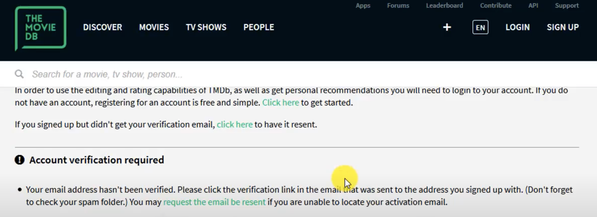
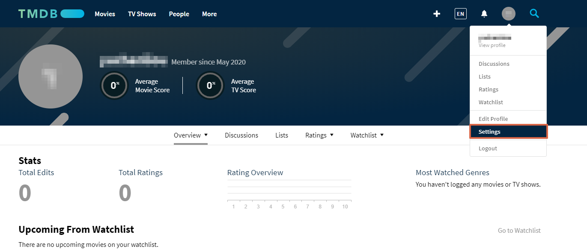
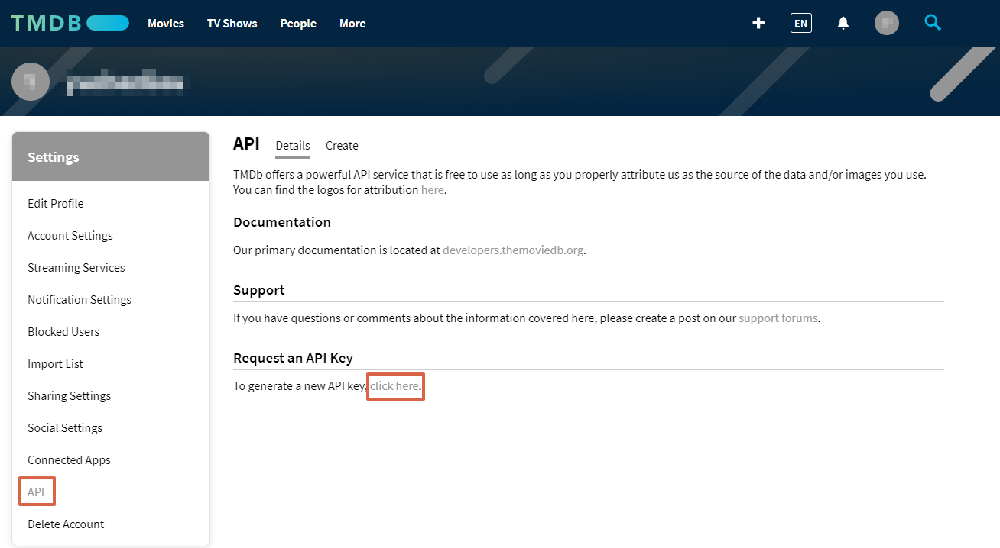
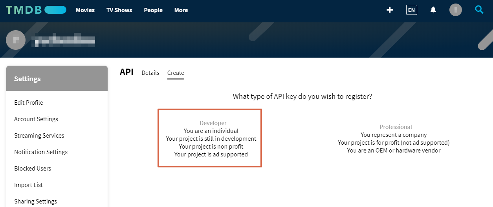
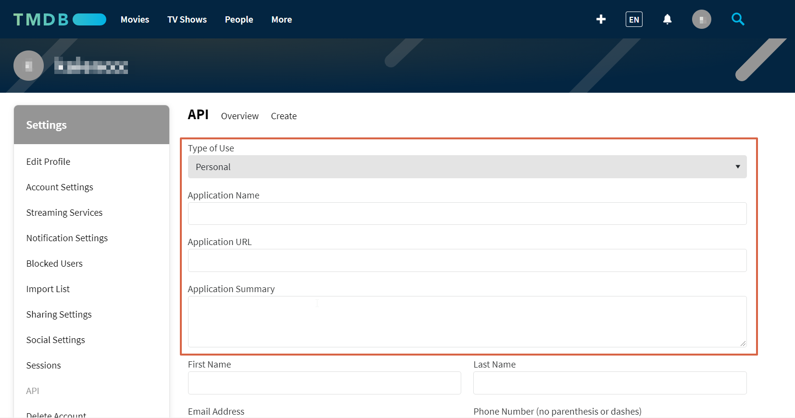
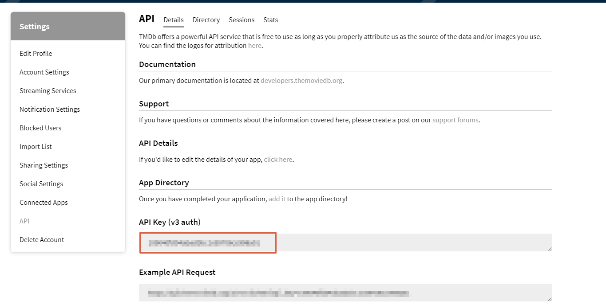

# How to Use The Moive Database to query about moives

Movie DB is a online database allow us to search for movies, tv shows, actors/actresses and images.
I will use movie search as an example.


## How to Get Your API_KEY at TMDB.

### 1. [Sign up](https://www.themoviedb.org/signup) 


### 2. Check Email for account


### 3. After Sign Up, go to [your account](https://www.themoviedb.org/settings/account) to create a API_KEY.


### 4. [API Setting](https://www.themoviedb.org/settings/api)


### 5. Choose the developer plan


### 6. Fill in your application details


### 7. You can find your API_KEY [here](https://www.themoviedb.org/settings/api).


To learn more about API endpoints, [CheckThis](https://developers.themoviedb.org/3/getting-started/introduction)

* Show code example(s) of how you would use this API in PHP. Please put your code examples in fenced code blocks.

## This following code shows a PHP Laravel Get Route to query movie.

Access the following URL
	
	localhost/tmdb/moive/query={The moive you want to search, such as Mulan}

```php
Route::get('/tmdb/moive', function (Request $request) use ($api_key) {
	$api_key = "Your API_KEY";
	$query_term = $request->query('query');

	$url = "https://api.themoviedb.org/3/search/movie?api_key=$api_key&language=en-US&query=$query_term&page=1&include_adult=false";
	$response = Http::get($url)->object();

	return $response;
});
```

## Example Response Json

```json
	{
  "page": 1,
  "results": [
    {
      "adult": false,
      "backdrop_path": "/zMrk2G3XsnfYKiIp1NEfdtvDyBH.jpg",
      "genre_ids": [
        12,
        14,
        18
      ],
      "id": 337401,
      "original_language": "en",
      "original_title": "Mulan",
      "overview": "When the Emperor of China issues a decree that one man per family must serve in the Imperial Chinese Army to defend the country from Huns, Hua Mulan, the eldest daughter of an honored warrior, steps in to take the place of her ailing father. She is spirited, determined and quick on her feet. Disguised as a man by the name of Hua Jun, she is tested every step of the way and must harness her innermost strength and embrace her true potential.",
      "popularity": 209.014,
      "poster_path": "/aKx1ARwG55zZ0GpRvU2WrGrCG9o.jpg",
      "release_date": "2020-09-04",
      "title": "Mulan",
      "video": false,
      "vote_average": 7,
      "vote_count": 5589
    },
	...
    {
      "adult": false,
      "backdrop_path": "/9O4qARYvsuCVTtw8ybLIQNTywTO.jpg",
      "genre_ids": [
        35,
        10751,
        10402
      ],
      "id": 650073,
      "original_language": "en",
      "original_title": "John Mulaney & The Sack Lunch Bunch",
      "overview": "John Mulaney and his kid pals tackle existential topics for all ages with catchy songs, comedy sketches and special guests in a nostalgic variety special.",
      "popularity": 7.34,
      "poster_path": "/rP8knLNDHN6VlUi89nWuqaWUdoo.jpg",
      "release_date": "2019-12-24",
      "title": "John Mulaney & The Sack Lunch Bunch",
      "video": false,
      "vote_average": 7.1,
      "vote_count": 75
    }
  ],
  "total_pages": 2,
  "total_results": 34
}
```